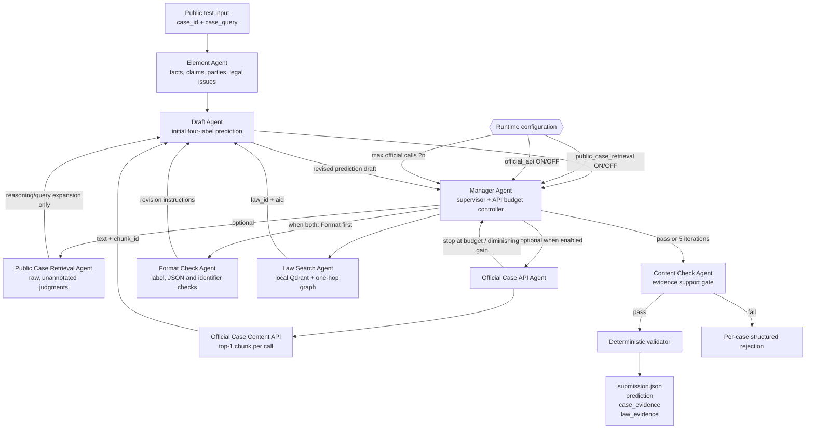

Competition: https://sites.google.com/view/alqac2026

# Database (this repository)

All retrieval artifacts live in the current branch:

Vector DB (Qdrant local-persistent):

```
data/vector/
```

Graph (JSONL adjacency, one-hop expansion from vector seeds):

```
data/graph/graph/nodes.jsonl
data/graph/graph/edges.jsonl
```

Law corpus (permitted ALQAC legal documents only):

```
data/legal_corpus/cleaned
```

Public test input (user-supplied): /home/nesfan/Desktop/HCMUS/Nam3/Legal_idk/alqac-2026-rag/data/ALQAC2026_public_test.json

# Required constraints

* Use official ALQAC data — public test and permitted raw legal documents only.
* **Draft Agent:** draft a structured four-label prediction, not consultation prose.
* **Format Check Agent:** validate ALQAC JSON and identifiers; suggestions only.
* **Content Check Agent:** verify evidence supports the prediction; must not invent evidence. Fail-closed.
* `case_evidence`: only official API `chunk_id` values.
* Public raw-judgment hits: query-expansion/reasoning only; never copy into `case_evidence`.
* Law evidence: only retrieved `{law_id, aid}` pairs from local vector+graph RAG.

# Retrieval switches

* `PUBLIC_CASE_RETRIEVAL_ENABLED=false` (default): public retrieval agent off.
* `OFFICIAL_API_ENABLED=false` (default): official API agent off (ablation / query-only baseline).
* `OFFICIAL_API_ENABLED=true` required for competitive pipeline because valid `case_evidence` needs official `chunk_id`s.
* Official API: always top-1 per call; shared batch budget `2 * n` calls for full efficiency; falls to zero at `5n`.
* Only official API calls count toward efficiency penalty.

# Architecture



# Flow (paper Algorithm 1 + ALQAC gates)

1. Element Agent → legal element graph (Table 8 JSON fields).
2. Draft Agent → initial four-label ALQAC prediction.
3. Manager loop (max 5 iterations or Pass):
   - optional Public Case Retrieval (if enabled and selected)
   - optional Official Case API top-1 (if enabled and selected; budgeted)
   - if both Format + Law selected: Format Check then Law Search
   - Draft revision after each tool path
4. Content Check pass/fail (no ID invention).
5. Deterministic validator → serialize only Content-Check-passed cases.

# Tech stack

Python 3.12, FastAPI, Deep Agents, LangGraph, langchain-openai (single `OPENAI_MODEL`), Qdrant local, JSONL GraphRAG, Langfuse, Pydantic Settings, Pytest.
